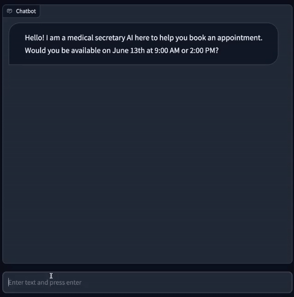

# 🧑 Customer-Service-GPT

Experimental LLM-native process-driven chatbots.

Process-driven chatbots assist users in completing tasks by guiding them through a sequence of steps, such as opening a bank account or scheduling an appointment.

These bots attempt to enforce business logic and validate user input while remaining resilient to non-linear conversation paths. 

## 👷 Install

Requirements: python 3.10 and [Poetry](https://python-poetry.org/docs/#installing-with-the-official-installer)
```bash
git clone ...
poetry install
```
Create an `.env` file at the root containing your OpenAI API key. 
```
OPENAI_API_KEY=<key>
```

## 🎬 Demos

### 📅 Appointment booking

An AI medical assistant helps users book appointments at the clinic by trying to find matching availability, answering questions, and collecting necessary information to confirm the appointment

```bash
poetry run python example_booking_bot.py
```

<div align="center">

</div>

### 💇 Duplex clone

This bot replicates the Google Duplex demo, in which an AI schedules a hair salon appointment. The AI is the customer assistant and the Human is the hair salon attendant.
```bash
poetry run python example_booking_bot.py
```


<div align="center">

</div>

## ⚙️ How it works

The `ProcessChain` is a sequential [Langchain](https://github.com/hwchase17/langchain) chain working as follows:

1. `NERChain` extracts entities from the user response based on examples
2. `ValidationChain` stores entity values in variables if they are valid
3. `ConversationChain` evaluates the context and asks the next question or provides feedback.

The `ProcessChain` outputs a `result` object with the information collected when the task is completed.

### The Process definition
The process is a pydantic model where fields are described.
The fields will be collected during the process using the questions provided, validated with the validators and the errors messages will be surfaced in the conversation.

```python
class MyForm(Process):
    process_description = """
You are a retail bank account executive AI.
Your goal is to collect the required information from the User to open a bank account.
"""
    first_name: str = Field(
        name="First name",
        description="First name of the user, required to open an account",
        question="What is your first name?",
    )
    age: int = Field(
        name="Age",
        description="Age of the user, required to open an account",
        question="What is your age?",
    )
    confirmed: bool = Field(
        name="Confirmed",
        description="Whether the user has confirmed their details",
        question="You are {{first_name}} {{last_name}}, you are {{age}} years old and your current occupation is {{occupation}}. Is that correct?"
        "",
        exclude=True,
    )

    @validator("first_name")
    def validate_first_name(cls, v):
        assert v[0].isalpha(), "First name must start with a letter."
        return v.capitalize()

    @validator("age")
    def validate_age(cls, v):
        assert v is None or v >= 18, "Age must be 18 or older"
        return v
    
    @validator("confirmed")
    def validate_confirmed(cls, v):
        assert v is True, "Please provide me with the correct information"
        return v  
    
```
### Entities

Although entities generally match form fields, they are not the same. Entities are extracted from the user input, then processed by the `ValidationChain` which may decide to save values to variables.

```python
examples = [
    {"text": "I'm Nathan", "entities": [{"name": "first_name", "value": "Nathan"}]},
    {
        "text": "I'm jenny and I'm 98 yo",
        "entities": [
            {"name": "first_name", "value": "Jenny"},
            {"name": "age", "value": 98},
        ],
    },
    {
        "text": "I'm Jo Neville and I'm a plumber",
        "entities": [
            {"name": "first_name", "value": "Jo"},
            {"name": "last_name", "value": "Neville"},
        ],
    },
    {
        "context": "Is everything correct?",
        "text": "No",
        "entities": [{"name": "confirmed", "value": False}],
    },
    {
        "context": "Do you confirm the information above?",
        "text": "Yes",
        "entities": [{"name": "confirmed", "value": True}],
    },
    {"context": "How old are you?", "text": "Yes", "entities": []},
]
```
Notice that the `value` might not be related to a particular substring in the `text`. Observe the last two examples which aim to capture a confirmation based on a yes or no. We want the entity to be extracted only in the `context` of confirming data, but not if the `context` of answering a specific question.

### The `ProcessChain`
The `ProcessChain` glues everything together.

```python
openai_entity_extractor_llm = ChatOpenAI(temperature=0, client=None, max_tokens=256)
openai_chat_llm = ChatOpenAI(temperature=0, client=None, max_tokens=256)

process_chain = ProcessChain(
    ner_llm=openai_entity_extractor_llm,
    chat_llm=openai_chat_llm,
    entities={
        "first_name": Entity,
        "age": IntEntity,
        "last_name": Entity,
        "confirmed": BooleanEntity,
    },
    entity_examples=[EntityExample.parse_obj(e) for e in examples],
    form=MyForm,
    memory=ConversationMemory(),
    verbose=True,
)
```

Then launch the bot and open the url provided:

```python
gradio_bot(chain=process_chain, initial_input="hey", title="FormBot").launch() # Hey is a trick to get the bot to start the conversation as it normally reacts to a user input
```

See code examples for more details and more complex entities such as dates.
